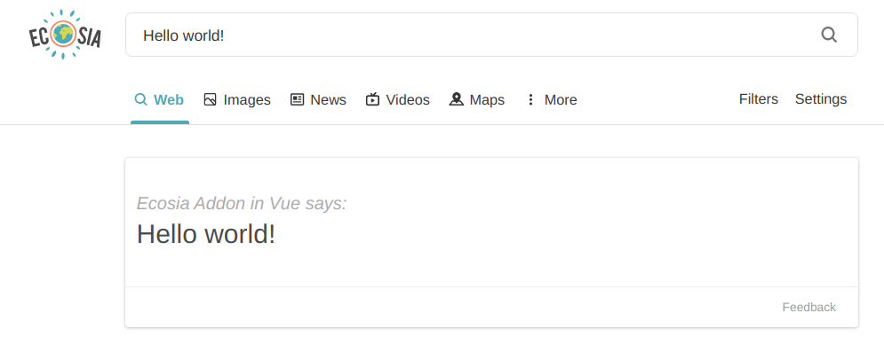

# ecosia-addon-vue

## Ecosia Addon in Vue (E.A.V.)
**A tool that makes planting trees even easier**

### About
This is boilerplate code for making a search extension for Ecosia. It allows developers to easily create cool features like DuckDuckGo's [password generation feature](https://duckduckgo.com/?q=password+strong+12&ia=answer) _[(more info)](https://help.duckduckgo.com/duckduckgo-help-pages/features/instant-answers-and-other-features/)_ or Google(🤢)'s [timer feature](https://www.google.com/search?q=timer) with Vue. I originally made this same plugin in React, but shortly after found that [Ecosia uses Vue](https://builtwith.com/detailed/ecosia.org), so I finally took a bit of time to rewrite it in hopes that this tool will be put to good use some day.
My example plugin just echos "Hello world" if you search it in Ecosia... but the possibilities are truly endless! The idea is that cool new features will help reel in new users to Ecosia, and new Ecosia users === more trees planted 🌳💞.

<!--  -->

### Installation
```
# clone the repo
$ git clone git@github.com:nbennett320/ecosia-plugin-vue.git

# not sure what does but it seems to work
$ cd ecosia-plugin-vue/

# install dependencies
$ yarn install
```

### Usage
Using E.A.V. is very simple &ndash; all you need to do is replace the `<ExampleComponent/>` in `src/components/ExampleComponent.vue` with a component of your own:
```
<template>
  <div id="v-ecosia-widget-container" class="widget-container">
    <!-- replace me! -->
    <ExampleComponent :query="query" />
    <Footer />
  </div>
</template>
```
With this tool, Ecosia search results and instant answers are limited only by your imagination! 
<!-- <br />
<br />
The scope which Content Scripts can access from the browser _(more about this [here](https://developer.mozilla.org/en-US/docs/Mozilla/Add-ons/WebExtensions/Content_scripts))_, so by default background scripts are enabled. For this reason, background scripts are used to implement even cooler features (like async things (like calling an API)) You can read more about this _[here](https://developer.mozilla.org/en-US/docs/Mozilla/Add-ons/WebExtensions/Content_scripts#Communicating_with_background_scripts)_, and _[these](https://developer.mozilla.org/en-US/docs/Mozilla/Add-ons/WebExtensions/API/runtime/onMessage)_ are some example use cases.
<br />
__If you want to remove/disable background scripts, do the following:__
<br />
 - Remove background scripts from the `src/manifest.json`
```
"background": {
  "scripts": [
    "lib/js/browser-polyfill.js",
    "background.js"
  ]
},
```
 - Remove this from `paths.js`
```
appBackgroundJs: resolveModule(resolveApp, 'src/background_scripts/index'),
```
 - Then you can just delete the `src/background_scripts` folder entirely if you want
<br /> -->

### Development && Building
```
# install dependencies
$ yarn install

# run a dev server in firefox or chrome (🤢)
$ yarn serve

# build files to '/dist'
$ yarn build

#lint and fix files
$ yarn lint

```