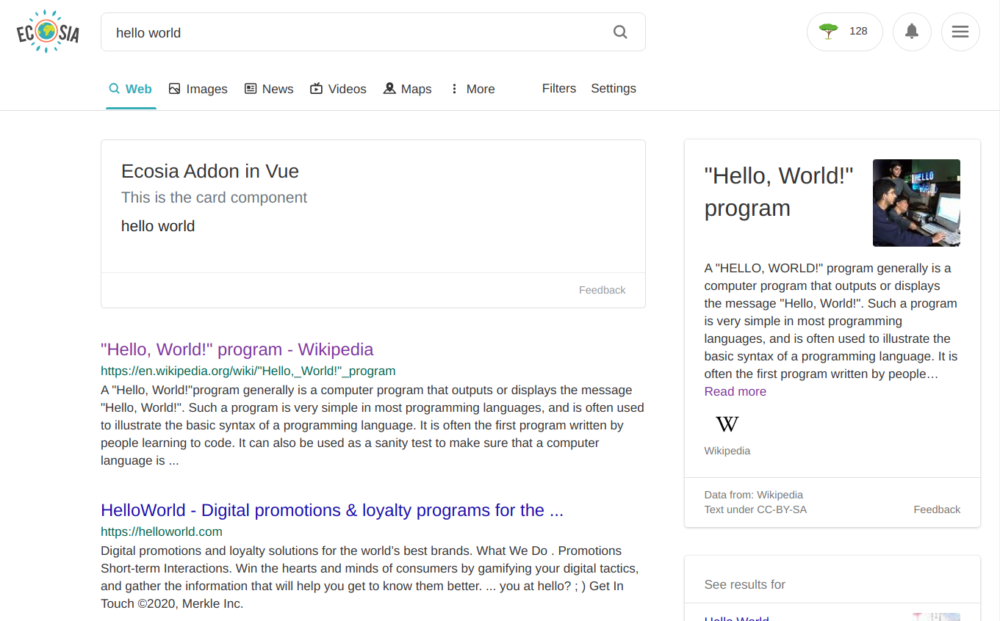
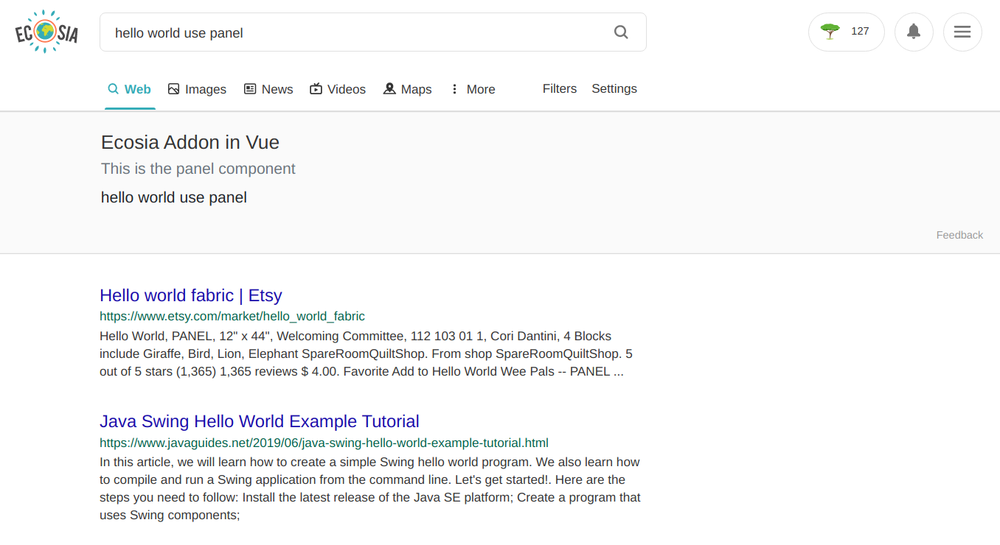

# ecosia-addon-vue

## Ecosia Addon in Vue (E.A.V.)
**A tool that makes planting trees even easier**

1. [About](#about)
2. [Installation](#installation)
3. [Usage](#usage)
4. [Development, building, & testing](#development)

----------------------------------------

<a name="about"></a>
### About
This is boilerplate code for making a search extension for Ecosia. It allows developers to easily create cool features like DuckDuckGo's [password generation feature](https://duckduckgo.com/?q=password+strong+12&ia=answer) _[(more info)](https://help.duckduckgo.com/duckduckgo-help-pages/features/instant-answers-and-other-features/)_ or Google(🤢)'s [timer feature](https://www.google.com/search?q=timer) with Vue. I originally made this same plugin in React, but shortly after found that [Ecosia uses Vue](https://builtwith.com/ecosia.org), so I finally took a bit of time to rewrite it in hopes that this tool will be put to good use some day.
My example plugin just parses the Ecosia searchbar and echos it into an example component I threw together... but other useful and creative additions are more than welcome (that _is_ why I made this tool after all)! The idea is that cool new features will help reel in new users to Ecosia, and new Ecosia users === more trees planted 🌳💞.
<br />
With this tool, Ecosia search results and instant answers are limited only by your imagination! 
<br />
In its current state, this repo includes two types of components &mdash; a card component and a panel component (pictured below, they're pretty heavily based on similar bootstrap components).
<br />


<br />


<br />

In my example, the panel component will be used when the search query includes the string, "use panel". Whether or not a particular feature uses a card or panel component is probably specific to the feature itself, thus I imagine a boolean value for the prop, "isPanel", will be sufficient in most use cases. For more information see the example in the [usage section](#usage).


<a name="installation"></a>
### Installation
```
# clone the repo
$ git clone git@github.com:nbennett320/ecosia-plugin-vue.git

# not sure what this command does but it seems to work
$ cd ecosia-plugin-vue/

# install dependencies
$ yarn install
```

<a name="usage"></a>
### Usage
The tool makes adding widgets to Ecosia (I like to call them EWs &mdash; Ecosia Widgets 🤡) is very simple; all you need to do is replace the applicable component, either `<CardContentExample/>` or `<PanelContentExample/>`in `src/components/` with a component of your own (or just replace the content of my example with content of your own).

```
<template>
  <div class="ew--panel-container">
    <!-- replace me! -->
    <PanelContentExample 
      :query="query"
    />
    <PanelFooter />
  </div>
</template>

<script>
export default {
  name: "Panel",
  components: {
    PanelContentExample,
    PanelFooter
  },
  props: {
    query: String,
  }
}
</script>
```

As of my most recent update to this repo, I have added a collection of css classes in `src/assets/css/styles.css` that are used with their respective components. All of the css classes specific to extension widgets begin with the prefix `ew--`. For example:

```
/* this class is used for the card component */
.ew--card {
  -webkit-box-flex: 1;
  -ms-flex: 1 1 auto;
  flex: 1 1 auto;
  padding: 1.25rem;
}

/* this class is used for the panel component */
.ew--panel {
  -webkit-box-flex: 1;
  -ms-flex: 1 1 auto;
  flex: 1 1 auto;
  padding: 1.25rem;
  padding-left: 10px;
  margin-left: 8.3333333333%;
}
```

The heart of this tool is found in `src/content-scripts/content-script.js`. Here we can parse a user's search query for keywords or patterns such that the EW in question is shown only when certain conditions are met. We also can specify whether or not the widget utilizes a card or panel component (though, obviously, custom components can just as easily by added).
The following example shows a boolean value for `isPanel`:

```
if(queryConditionMatches(searchQuery)) {
  new Vue({
    render: h => h(Widget, {
      props: {
        searchQuery,
        isPanel: true
      }
    }),
  }).$mount(mountPoint)
}
```

The parser I made in `src/content-scripts/parser.js` is very simple, and I'd wager most others will be just as simple:

```
const searchQuery => searchQuery.toLowerCase().includes("hello world")
```

This returns `true` if the user's search query includes the string, "hello world" (😏).
Let's say I want a dictionary widget to render only if the search query contains the term "define":

```
const searchQuery => searchQuery.toLowerCase().includes("define")
```

Obviously any number of conditions can be required for your widget to render.
I think it would be true to say that, since the Vue virtual DOM isn't even mounted unless these conditions are met, this extension should not affect search result times at all for non-matches.

<br />

The scope which content script can access from the browser is pretty limited _(more about this [here](https://developer.mozilla.org/en-US/docs/Mozilla/Add-ons/WebExtensions/Content_scripts))_. By default background scripts are enabled &mdash; background scripts can be used to implement even cooler features (like async things (like calling an API 😜)). You can read more about this _[here](https://developer.mozilla.org/en-US/docs/Mozilla/Add-ons/WebExtensions/Content_scripts#Communicating_with_background_scripts)_, and _[these](https://developer.mozilla.org/en-US/docs/Mozilla/Add-ons/WebExtensions/API/runtime/onMessage)_ are some example use cases.

<a name="development"></a>
### Development, Building, & Testing
```
# install dependencies
$ yarn install

# run a dev server in firefox or chrome (🤢)
$ yarn serve

# build files to '/dist'
$ yarn build

#lint and fix files
$ yarn lint
```